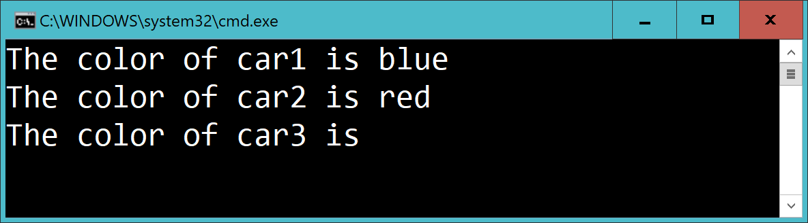



# Car 2

Create a class **Car** with methods **GetColor** and **SetColor**.

The following code:

    var c1 = new Car();
    var c2 = new Car();
    var c3 = new Car();

    c1.SetColor("blue");
    c2.SetColor("red");

    Console.WriteLine($"The color of car1 is {c1.GetColor()}");
    Console.WriteLine($"The color of car2 is {c2.GetColor()}");
    Console.WriteLine($"The color of car3 is {c3.GetColor()}");

...should give:

