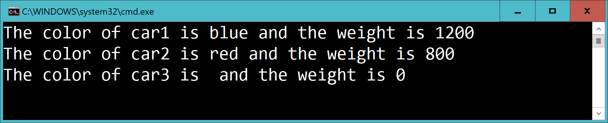

# Car 3

Add the methods **SetWeight** and **GetWeight**.

This:

    var c1 = new Car();
    var c2 = new Car();
    var c3 = new Car();

    c1.SetColor("blue");
    c1.SetWeight(1200);

    c2.SetColor("red");
    c2.SetWeight(800);

    Console.WriteLine($"The color of car1 is {c1.GetColor()} and the weight is {c1.GetWeight()}");
    Console.WriteLine($"The color of car2 is {c2.GetColor()} and the weight is {c2.GetWeight()}");
    Console.WriteLine($"The color of car3 is {c3.GetColor()} and the weight is {c3.GetWeight()}");

...should output:

