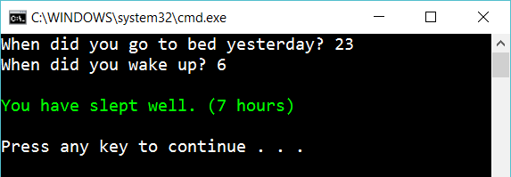

# 1 If statement

Create the following console app:

 
The user should input only integers (whole numbers). Calculate how many hours the user has slept and depending on the result write different messages:

- You've only slept 3 hours. Go back to bed!
- You've slept 14 hours. That's a lot.
- You have slept well. 

Don't care about time zones or daylight-saving time.

## Hint

Use

    if statements
    int.Parse(...)