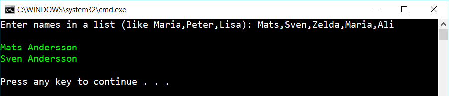

# 5 Foreach with break

Create the same program as before (the foreach-exercise). But if the list contains *Zelda*, then ignore the rest of the list:

Use foreach and break to solve the program.

## Hint

Read about

    foreach loops

    "break" inside of a loop