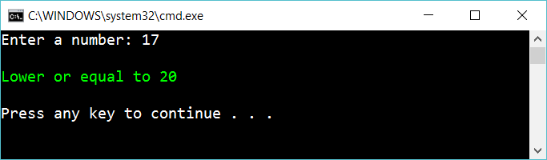

# 7 Conditional operator

Create the same app as previous exercise (the if-exercise)

But use the conditional operator **?:** to solve the problem. 

## Hint

Read about

    conditional if's

Set the string "mystring" to different things depending on the variable "somethingThatIsTrueOfFalse"

    string mystring = (somethingThatIsTrueOfFalse) ? "aaaa" : "bbbb"