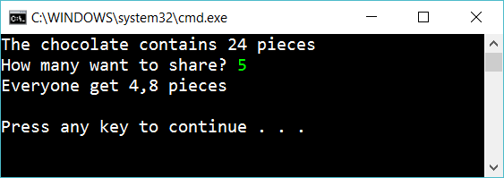
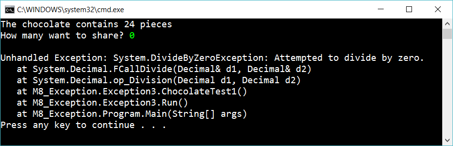
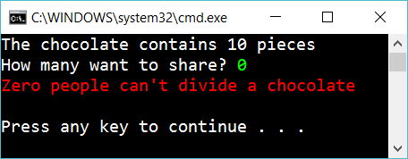

# 1 Dividing chocolate

Create an app that tells how many pieces each person get:

Don’t validate the input. If the user enters zero an exception should be generated:

Now, modify the program so you catch this exception. Use **try-catch** to solve this. If someone enters zero, it should now look like this:

## Hint

Use **decimal** instead of **double**

To set a decimal value write an **M** at the end:

    decimal mydecimal = 123M

Format a number to two decimals:

    Console.WriteLine($"Text text {mynumber:.##} text text");

