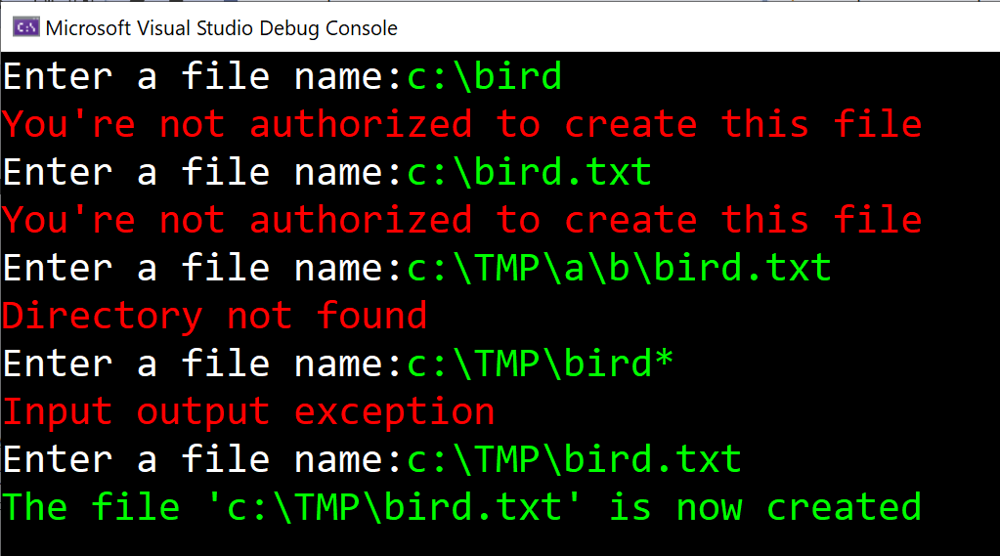

# Files and exceptions

Create the following console app:

(In the example above the user already has a folder c:\TMP)

The user should enter a filename to create. If there are any problems creating the file, like:

- the user aren’t allowed to create the file
- the folder don’t exist
- the user enters an invalid filename

…the app should respond, as you see above. Use **try-catch** to solve this problem.

## Hint

To create a text file:

    File.CreateText("yourfilename.txt");

Try different exceptions like for example: **UnauthorizedAccessException**

## Hint 2

You can catch different exceptions like this:

    try
    {
        ...
    }
    catch (UnauthorizedAccessException)
    {
        ...
    }
    catch (ArgumentException)
    {
        ...
    }
    catch (Exception)
    {
        ...
    }