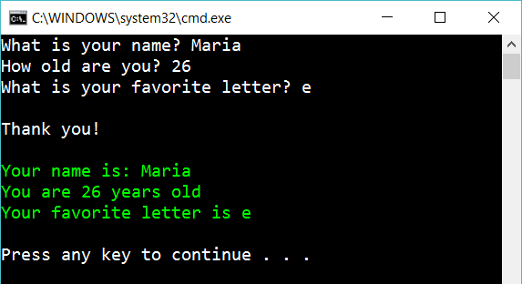

# Respond to user input

Create the following console app:

The program should ask the user for his/her name, age, and favorite letter. Then respond to the user (the green part). Use strings all the way.

## Hint

Try

    string myVariable = Console.ReadLine()!;
    Console.Write("Some text");
    Console.WriteLine("Some text");
    Console.ForegroundColor = ConsoleColor.Red;
    int.Parse(...)
    char.Parse(...)
