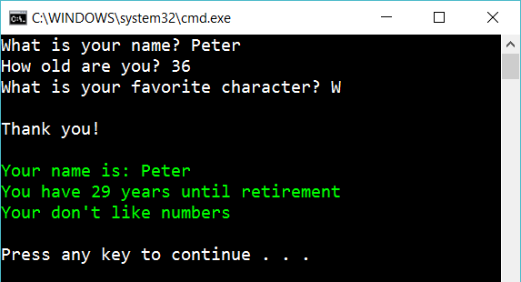

# Working with different types

Create the following console app:

It should work similar to the previous program. But the program should respond how many days until retirement. And write “You like numbers” if the user enter a number as a favorite character.

## Hint

Try

    int.Parse(...)
    char.Parse(...)
    Console.ForegroundColor
    char.IsNumber(...)
