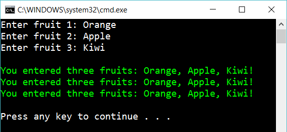

# String creation

Create the following console app:

The user enters **three** fruits and the program respond as you see (in green).

Write the same message three times (as you see in the image) and use three different ways to build up a string:

- Concatenation
- Using placeholders
- Interpolation

## Hint

Try

	"..." + "..." + "..."
    string.Format("...")
    var mystring = $"{myVariable1} some text {myVariable2}";