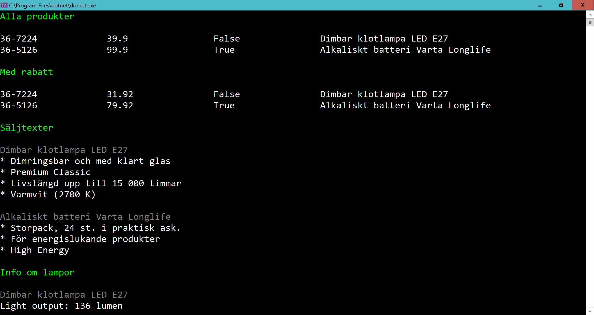

# Clas Ohlson

Create an abstract class **Product**

Create a class **Lightbulb** which inherits from *Product*

Create a class **Battery** which inherits from *Product*

Lightbulbs and batteries should have very similair features but:
- a lightbulb has a **LightOutput** (how bright the light is in lumen)
- a battery has a **Type** (e.g "AAA" or "AA")

All products should have these methods:
- *GetBulletsAsString* should create a star-separated string from the property *Bullets*
- *ApplyDiscount* should reduce the price with 20%

Here two products are created:

	var p1 = new Lightbulb
	{
		Id = "36-7224",
		Description = "Dimbar klotlampa LED E27",
		Price = 39.9M,
		InStore = false,
		Bullets = new List<string>
		{
			"Dimringsbar och med klart glas",
			"Premium Classic",
			"Livslängd upp till 15 000 timmar",
			"Varmvit (2700 K)"
		}
	};

	var p2 = new Battery
	{
		Id = "36-5126",
		Description = "Alkaliskt batteri Varta Longlife",
		Price = 99.9M,
		InStore = true,
		Bullets = new List<string>
		{
			"Storpack, 24 st. i praktisk ask.",
			"För energislukande produkter",
			"High Energy"
		}
	};

Here some properties are set:

	p1.LightOutput = 136;
	// p2.LightOutput = 666; // <---- this shouldn't work

	// p1.Type = "...."; // <---- this shouldn't work
	p2.Type = "AA/LR06";

	     

...and we make a list of the products:

	var products = new List<Product>();
	products.Add(p1);
	products.Add(p2);

	 //var test = new Product(); // <---- this shouldn't work

The following code:

	cc.WriteLineGreen("\nAlla produkter\n");
	ShowProductInfo(products);

	ApplyDiscountOn(products);

	cc.WriteLineGreen("\nMed rabatt\n");
	ShowProductInfo(products);

	cc.WriteLineGreen("\nSäljtexter\n");
	SalesTexts(products);

	cc.WriteLineGreen("\nInfo om lampor\n");
	ShowInfoAboutAllLightbulbs(products);

...should output the following:

