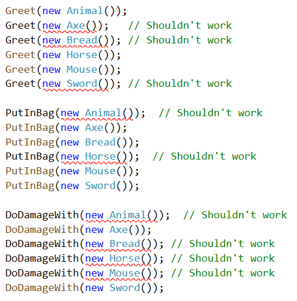

# Axes and horses

Create the following classes:
- Animal
- Axe
- Bread
- Horse
- Mouse
- Sword

 Create these methods:
 - Greet
 - PutInBag
 - DoDamageWith

 The methods should accept the right object. Here you see what the methods should expect:

 
 
 Create necessary interfaces and use inheritance to solve this problem.