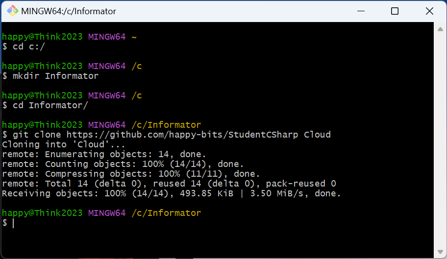
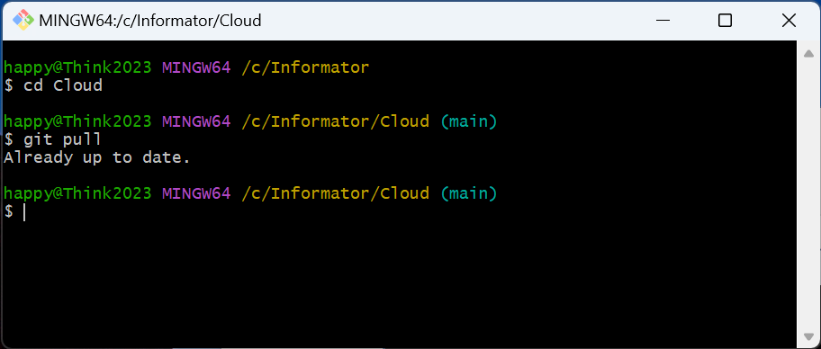

# Install Visual Studio Community

Go to this page:

https://visualstudio.microsoft.com/downloads/

Select **Free download** under Community

Run the installation

# Setup GIT

Go to this page:

https://git-scm.com/download/win

Click on **64-bit Git for Windows Setup** below **Standalone Installer**

Run *Git Bash*

Enter the following commands:

	cd cd:/
	mkdir Informator
	cd Informator
	git clone https://github.com/happy-bits/StudentCSharp Cloud

(shift insert to paste text in Git Bash)

# New material

If the teacher add new material, just do **git pull** in the folder c:/Informator/Cloud

	