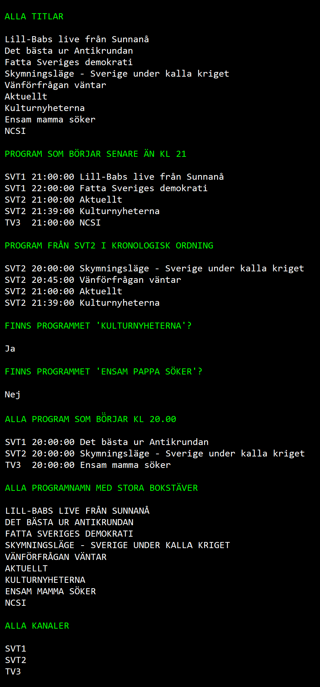

# TV Shows

Create a file **tv-data.txt** with the following content:

	SVT1*21:00*Lill-Babs live från Sunnanå
	SVT1*20:00*Det bästa ur Antikrundan
	SVT1*22:00*Fatta Sveriges demokrati
	SVT2*20:00*Skymningsläge - Sverige under kalla kriget
	SVT2*20:45*Vänförfrågan väntar
	SVT2*21:00*Aktuellt
	SVT2*21:39*Kulturnyheterna
	TV3*20:00*Ensam mamma söker
	TV3*21:00*NCSI

Create a console app that displays the following information based on *tv-data.txt*:

Use **LINQ** to solve this exercise.

Create a class **Show** that reflect on on the rows above

Your main program should look like this:

	string[] rows = ReadTvShowFile();
	List<Show> allShows = ParseTvShows(rows);
	DisplayInfoAboutShows(allShows);

## Hint

Read about the following Linq methods:
- Where
- OrderBy
- Select
- Any
- Count
- Distinct

To read all lines in a textfile:

	string result[] = File.ReadAllLines("filename.txt");