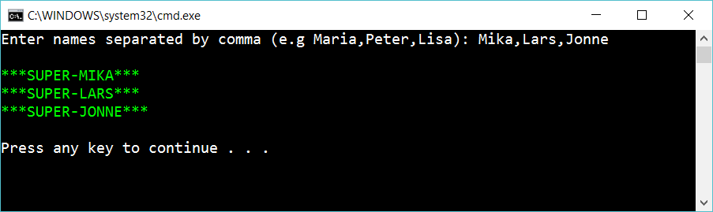

# 2 Clean user input

Continue on the previous program. 

 
 
Add a method **CleanUpArray** that takes an array as parameter and removes trailing and leading spaces. If one of the names is “   Kjell   “ then clean the value to “Kjell”. 

## Hint

Use

    mystring.Trim() 