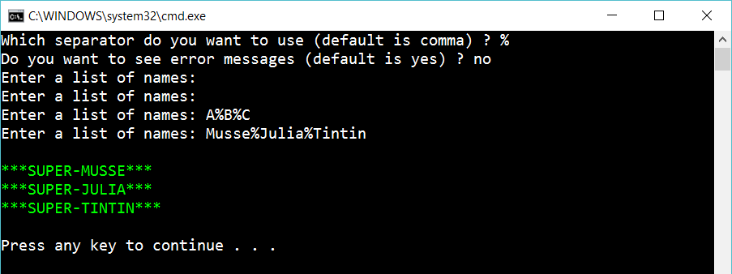

# 4 More options

Continue on the app and let the user decide on which separator to use and if he/she wants to see error messages:

 
 
In the example above the user didn’t want to see error messages.

## Hint

To solve this, create two more methods:

	char AskUserForSeparator()
	bool AskUserForErrorMessage()

Check if a string is null och whitespace:

    myString.IsNullOrWhiteSpace(...)

Try to parse a string to a character:

    char.TryParse(...)
