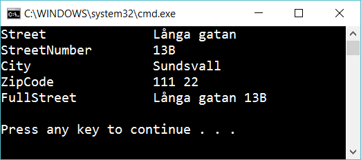

# Get accessor

Create a class **Address**. The class should have the following properies:

- Street
- StreetNumber
- City
- ZipCode

First create a method *GetFullStreet* that returns street combined with the streetnumber.

Then create *getter* named *FullStreet* that should work in the same way.

Create an instance of Address. Write the values of the object as shown below:

## Hint

A normal class method:

    public string GetFullStreet()
    {
        return "....";
    }

A getter:

    public string FullStreet
    {
        get
        {
            return "...";
        }
    }

The same as above but shorter:

    public string FullStreet => "...";
