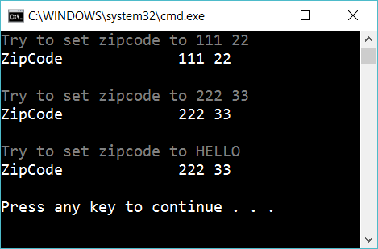

# Set accessor

Add a method *SetZipCode* that only change the zipcode if the zipcode is valid.

If someone want to change the zipcode to 234 56, it is okey. But if he/she tries to change the zipcode to 23X 45 or 23456 it shouldn’t be allowed. The only valid pattern is

    NNN NN
  
Where N is a number. 

Create an instance of Address and set the value of zipcode to different values:

Create a method *GetZipCode* that returns the zipcode.

Next, create a property *ZipCode* with setters and getters, so you don't need the methods *GetZipCode* and *SetZipCode*

## Hint

A normal class method:

    public void SetZipCode(string newvalue)
    {
        ...
    }

A setter:

    public string ZipCode
    {
        set
        {
            ...
        }
    }